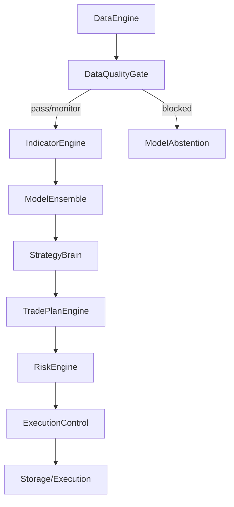
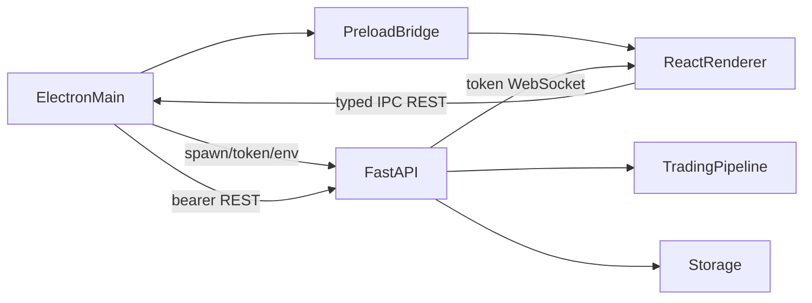

# System Architecture

## High-Level Architecture
This is a modular, pipeline-driven trading application. Data flows sequentially through discrete phases.

## Data Quality and Abstention Flow

* `DataEngine.clean_candles()` validates ordering, duplicates, missing timestamps, OHLC rows, robust price outliers, and optional wall-clock freshness.
* Direct historical cycles omit the wall-clock reference so old but valid replay data is not marked stale. Live provider cycles pass a UTC reference and provider status.
* Incomplete higher-timeframe buckets are measured on every 1m cycle. They are filtered when `ENABLE_DATA_QUALITY_GATE=1`.
* If the enabled gate has blocking reasons, pipeline adapters are skipped and `ModelEnsembleEngine.build_abstain_predictions()` supplies deterministic HOLD contracts. Existing dynamic weights are retained.
* Quality results and pre-persistence stage timings live inside `signal_snapshots.risk_filters_json`; cycle API payloads also return the quality report and complete timing map.

## Backend Structure
*   **Language**: Python 3.10+
*   **Framework**: FastAPI + Uvicorn
*   **Concurrency**: Async/await for APIs and websocket broadcasts; synchronous processing for heavy ML/DataFrame math.
*   **Event Flow**: `event_bus.py` provides pub/sub. Background runner emits cycle updates to the bus, which the websocket pushes to clients.

## Frontend Structure
* Legacy: vanilla JS / HTML / CSS in
  `src/gold_signal_system/dashboard_static/`.
* Desktop: Electron main/preload in `app/main/`, shared IPC contracts in
  `app/shared/`, and React/TypeScript renderer in `app/renderer/`.
* Electron main owns the Python process, random loopback port, per-launch token,
  local settings, encrypted secrets, and REST proxy.
* Packaged Python resolution is fail-closed. Development resolution checks the
  staged private runtime, then `.venv`, and permits system Python only through
  an explicit environment opt-in.
* Electron supplies encrypted or explicitly inherited backend secrets and
  blocks implicit repository `.env` credentials by setting absent sensitive
  keys to empty values. Both `POSTGRES_DSN` and `POSTGRES_SCHEMA` are passed
  through this protected configuration path. The legacy Python entry points
  retain their existing `.env` behavior.
* `app/shared/redaction.ts` is the shared diagnostic boundary for persisted
  backend logs, backend/UI error messages, failed REST diagnostics, and future
  support-bundle payloads.
* The renderer has no Node integration. It uses a narrow `contextBridge` API,
  typed REST client, and authenticated `/ws/events` client with bounded
  reconnect and targeted refreshes.
* Existing endpoint paths, payload shapes, and WebSocket event names remain
  backend-authoritative.

## Desktop Process Flow

* `scripts/run_backend.py` invokes the idempotent database initializer before
  importing/serving the API, binds only to `127.0.0.1`, and prints a JSON
  readiness record after Uvicorn is listening. Database initialization errors
  emit a detail-free warning and preserve the backend's in-memory fallback.
* Runtime writes resolve under `%LOCALAPPDATA%\NEWXAU\runtime`; packaged
  resources resolve independently of the current working directory.
* Desktop shutdown first requests bounded graceful backend shutdown and then
  terminates the owned child only as a fallback. Expected exits are tracked by
  child identity so a delayed old-child exit cannot clear or auto-restart a
  newly spawned backend.
* Release verification compares complete SHA-256 runtime/model manifests, then
  executes native-library and backend-import smoke tests from an unrelated
  temporary package layout.
* Runtime imports are warmed before manifest generation. The owned backend sets
  `PYTHONDONTWRITEBYTECODE=1`, preserving the packaged inventory after launch.

## Database / Data Layer
*   **Engine**: PostgreSQL.
*   **Schema**: Uses `newxau` schema space to avoid collision with standard Kronos schema.
*   **ORM**: Raw SQL via `psycopg`, managed centrally in `storage.py`.
*   **Fallback**: An in-memory dict structure mimics the DB if PostgreSQL fails to connect.
*   **Settings**: Runtime dashboard settings are persisted through `system_settings`.
*   **Execution Control Audit**: Control Unit decisions are stored in `execution_control_decisions`.
*   **Desktop startup**: The headless launcher runs `scripts/init_db.py` before
    Uvicorn. Repository-local PostgreSQL auto-start is available only when its
    `LOCAL_POSTGRES_*` data/bin settings resolve on that machine; packaged
    resources do not contain a PostgreSQL server or data cluster.

## Execution Control Flow
1. Dashboard writes Control Unit config through `/api/execution/control`.
2. Config is validated by `ExecutionControlConfig` and stored as `execution_control.active`.
3. `CapitalExecutionService` calls `ExecutionControlService.evaluate()` during preflight.
4. Disabled sessions or failed Kronos/ensemble relation gates return a normal BLOCKED execution result before any broker submission.
5. Decision stats are served through `/api/execution/control/stats`.

## Gold Market Session Flow
*   `market_sessions.py` is the canonical XAUUSD session schedule.
*   Timestamps are classified after conversion to `Asia/Amman`; server-local timezone is not used.
*   Runtime sessions are `DAILY_BREAK`, `ASIA_LOW`, `LONDON_ACTIVE`, `US_OVERLAP`, and `NY_ACTIVE`.
*   `DAILY_BREAK` has highest priority and is a hard non-trading session for the Control Unit.
*   Indicator snapshots, Control Unit fallback classification, dynamic model-weight context, and rules-based news labels consume this shared resolver.

## Background Workers
*   Triggered in `api.py` via `asyncio.create_task(run_background_cycle_loop())` if `ENABLE_BACKGROUND_CYCLE_RUNNER=1`.
*   The cycle runner handles polling, pipeline execution, and event emission.

## Deployment / Runtime Flow
1. Load environment variables.
2. Initialize DB schema (`scripts/init_db.py`).
3. Boot FastAPI server.
4. Clients connect, prompting historical data fetch and establishing websocket.
5. Cycle Runner polls API -> generates signals -> stores to DB -> executes (if armed) -> emits WS event.
