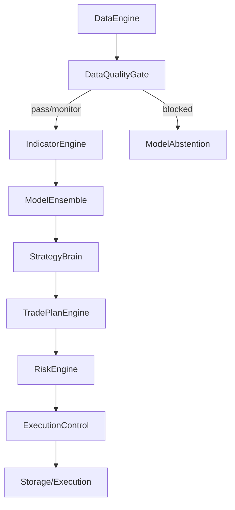

# System Architecture

## High-Level Architecture
This is a modular, pipeline-driven trading application. Data flows sequentially through discrete phases.

## Data Quality and Abstention Flow

* `DataEngine.clean_candles()` validates ordering, duplicates, missing timestamps, OHLC rows, robust price outliers, and optional wall-clock freshness.
* Direct historical cycles omit the wall-clock reference so old but valid replay data is not marked stale. Live provider cycles pass a UTC reference and provider status.
* Incomplete higher-timeframe buckets are measured on every 1m cycle. They are filtered when `ENABLE_DATA_QUALITY_GATE=1`.
* If the enabled gate has blocking reasons, pipeline adapters are skipped and `ModelEnsembleEngine.build_abstain_predictions()` supplies deterministic HOLD contracts. Existing dynamic weights are retained.
* Quality results and pre-persistence stage timings live inside `signal_snapshots.risk_filters_json`; cycle API payloads also return the quality report and complete timing map.

## Backend Structure
*   **Language**: Python 3.10+
*   **Framework**: FastAPI + Uvicorn
*   **Concurrency**: Async/await for APIs and websocket broadcasts; synchronous processing for heavy ML/DataFrame math.
*   **Event Flow**: `event_bus.py` provides pub/sub. Background runner emits cycle updates to the bus, which the websocket pushes to clients.

## Frontend Structure
*   Vanilla JS / HTML / CSS located in `src/gold_signal_system/dashboard_static/`.
*   Connects to `/api` endpoints for historical REST queries.
*   Connects to `/ws/events` for live streaming updates.

## Database / Data Layer
*   **Engine**: PostgreSQL.
*   **Schema**: Uses `newxau` schema space to avoid collision with standard Kronos schema.
*   **ORM**: Raw SQL via `psycopg`, managed centrally in `storage.py`.
*   **Fallback**: An in-memory dict structure mimics the DB if PostgreSQL fails to connect.
*   **Settings**: Runtime dashboard settings are persisted through `system_settings`.
*   **Execution Control Audit**: Control Unit decisions are stored in `execution_control_decisions`.

## Execution Control Flow
1. Dashboard writes Control Unit config through `/api/execution/control`.
2. Config is validated by `ExecutionControlConfig` and stored as `execution_control.active`.
3. `CapitalExecutionService` calls `ExecutionControlService.evaluate()` during preflight.
4. Disabled sessions or failed Kronos/ensemble relation gates return a normal BLOCKED execution result before any broker submission.
5. Decision stats are served through `/api/execution/control/stats`.

## Gold Market Session Flow
*   `market_sessions.py` is the canonical XAUUSD session schedule.
*   Timestamps are classified after conversion to `Asia/Amman`; server-local timezone is not used.
*   Runtime sessions are `DAILY_BREAK`, `ASIA_LOW`, `LONDON_ACTIVE`, `US_OVERLAP`, and `NY_ACTIVE`.
*   `DAILY_BREAK` has highest priority and is a hard non-trading session for the Control Unit.
*   Indicator snapshots, Control Unit fallback classification, dynamic model-weight context, and rules-based news labels consume this shared resolver.

## Background Workers
*   Triggered in `api.py` via `asyncio.create_task(run_background_cycle_loop())` if `ENABLE_BACKGROUND_CYCLE_RUNNER=1`.
*   The cycle runner handles polling, pipeline execution, and event emission.

## Deployment / Runtime Flow
1. Load environment variables.
2. Initialize DB schema (`scripts/init_db.py`).
3. Boot FastAPI server.
4. Clients connect, prompting historical data fetch and establishing websocket.
5. Cycle Runner polls API -> generates signals -> stores to DB -> executes (if armed) -> emits WS event.
